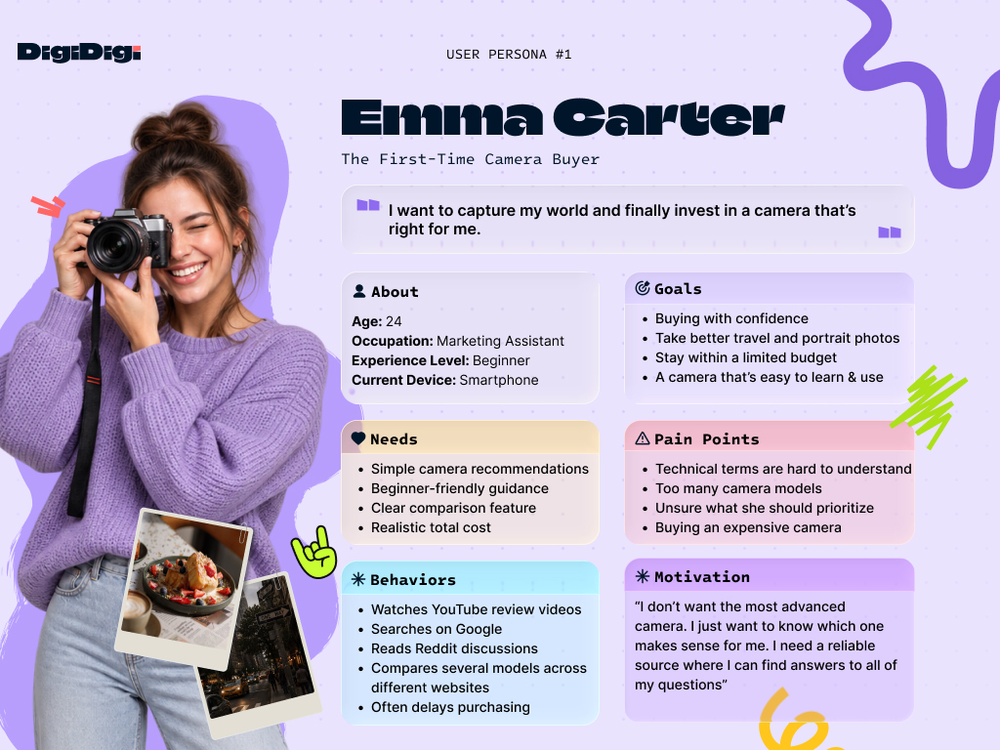
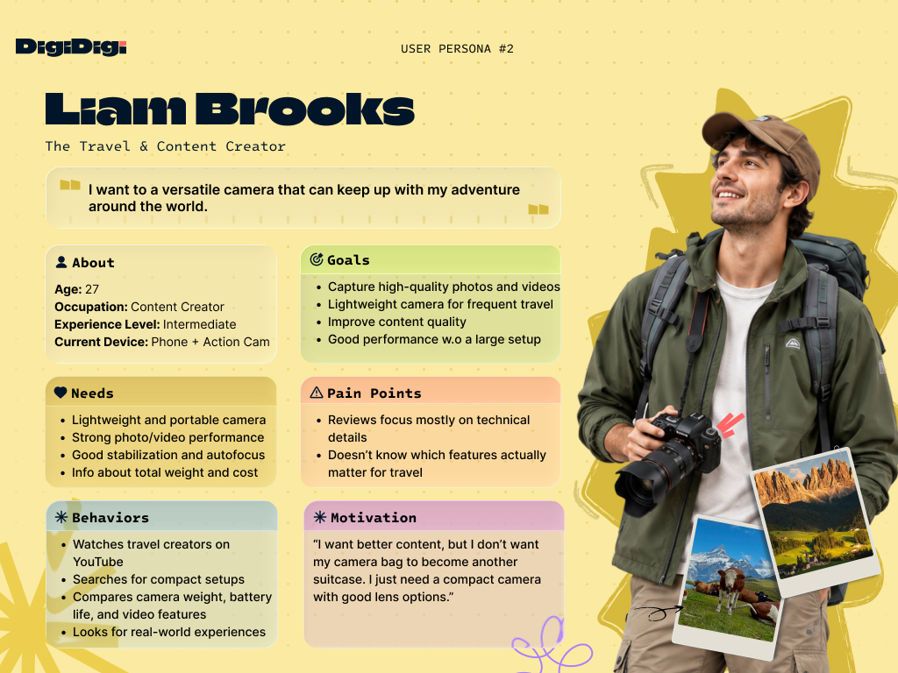
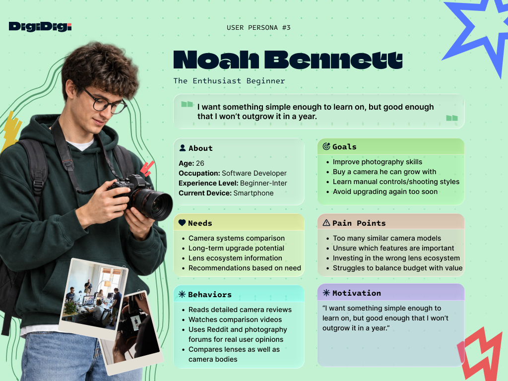

# DigiDigi 📷

A beginner-friendly camera discovery platform that helps users find the right camera based on their needs, budget, experience level, and photography goals.

This project is being developed as part of a 4-week UI/UX Design Internship at Skill Set Go EduTech.

---

## Overview

Buying a first camera can be confusing.

Most camera websites focus heavily on technical specifications such as sensor size, megapixels, autofocus points, aperture, stabilization, and video formats.

For beginners, these specifications often make the decision-making process more difficult instead of easier.

DigiDigi aims to simplify this experience by helping users choose a camera based on what they actually want to do with it.

---

## Problem

First-time camera buyers often:

- Feel overwhelmed by technical specifications
- Do not understand photography terminology
- Struggle to compare cameras meaningfully
- Are unsure which camera fits their actual use case
- Focus only on the camera body price and overlook lenses and accessories
- Spend too much time researching without feeling confident about their decision

---

## Target Users

DigiDigi is primarily designed for:

- First-time camera buyers
- Smartphone photographers looking to upgrade
- Beginner photographers
- Travelers looking for a suitable camera
- Content creators interested in photography and video
- Users with limited technical camera knowledge

---

## Project Goal

The goal of DigiDigi is to make buying a first camera:

- Easier
- Faster
- More understandable
- More personalized
- Less intimidating

Instead of asking users to understand camera specifications first, DigiDigi translates their needs into suitable camera recommendations.

---

## Core Features

### Personalized Camera Finder
Users answer simple questions about:

- Budget
- Experience level
- Photography goals
- Preferred subjects
- Portability
- Video needs
- Low-light usage

The platform then recommends suitable cameras.

### Use-Case Based Discovery
Users can explore cameras based on what they want to shoot:

- Travel
- Portrait
- Street
- Everyday photography
- Wildlife
- Video
- Content creation

### Beginner-Friendly Explanations
Technical specifications are explained using simple, real-world examples instead of complex terminology.

### Camera Comparison
Users can compare selected cameras side by side.

### Recommendation Explanation
Each recommendation explains:

- Why the camera fits the user
- Its main strengths
- Its limitations
- Who it is best suited for

### Total Cost Overview
The platform considers the realistic cost of starting photography, including:

- Camera body
- Lens
- Memory card
- Battery
- Essential accessories

### Lens Recommendations
Users can discover suitable beginner lenses based on their preferred photography style.

### Interactive Photography Guide
Photography concepts can be explained visually, including:

- Aperture
- ISO
- Shutter speed
- Focal length
- Background blur

---

## UX Process

The project will follow an end-to-end UX design process:

1. UX Research
2. User Interviews
3. Personas
4. User Journey
5. Information Architecture
6. User Flow
7. Low-Fidelity Wireframes
8. High-Fidelity UI Design
9. Interactive Prototype
10. Usability Testing
11. Design System
12. Responsive Design
13. Accessibility Improvements
14. Final UX Case Study

---

## Research

Research is currently in progress.

The research will focus on understanding:

- How beginners currently choose cameras
- Which parts of the buying process are confusing
- Which information users consider most important
- Which camera specifications are difficult to understand
- What increases confidence during a purchase decision

---

## Personas

### Emma Carter — First-Time Camera Buyer

### Liam Brooks — Travel & Content Creator

### Noah Bennett — Enthusiast Beginner

[Download the full User Personas PDF](docs/personas/DigiDigi_User_Personas.pdf)

---

## User Flow

The DigiDigi user flow maps the journey from onboarding and authentication to the app's five main areas: Home, Finder, Community, Compare, and Saved.

[View the full User Flow PDF](docs/user-flow/DigiDigi_User_Flow.pdf)

---

## Low-Fidelity Wireframes

The initial DigiDigi wireframes were sketched on paper to quickly explore the app structure, navigation, and core user journeys before moving into high-fidelity design.

The wireframes focus on the main experience across Home, Camera Finder, personalized recommendations, Camera Details, Community, Compare, Saved, and Profile.

### Problem

First-time camera buyers are often overwhelmed by technical specifications and struggle to understand which camera best fits their actual needs, budget, and photography goals.

DigiDigi aims to simplify this process by providing a guided, beginner-friendly camera discovery experience.

[View the full Wireframes PDF](docs/wireframes/DigiDigi_Low_Fidelity_Wireframes.pdf)

---

## Final UI

Coming soon.

---

## Prototype

Figma prototype will be added here.

---

## Usability Testing

Usability testing will be conducted with beginner or first-time camera buyers.

Findings and design iterations will be documented here.

---

## Design System

The DigiDigi design system will include:

- Color system
- Typography
- Spacing system
- Grid
- Buttons
- Form elements
- Camera cards
- Comparison components
- Navigation
- Icons
- Responsive components

---

## Tools

- Figma
- FigJam
- GitHub
- Google Forms / Surveys
- User Interviews

---

## Project Status

🚧 In Progress

Current phase: **Research & Design Foundations**

---

## Author

**Fatima Abdullayeva**

UI/UX Design Intern  
Skill Set Go EduTech
